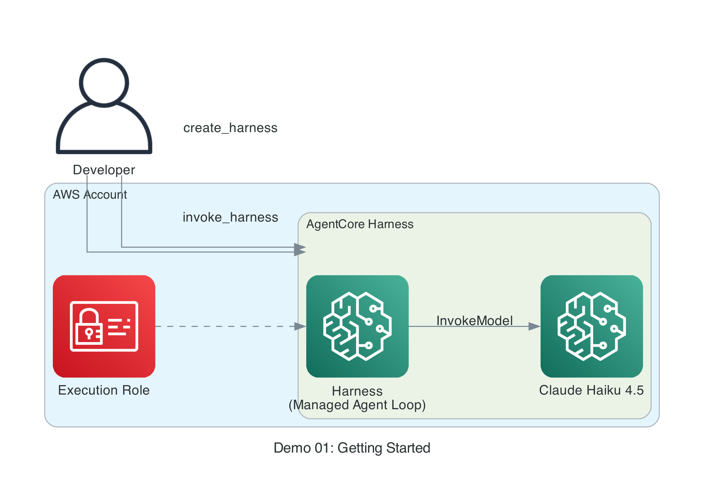
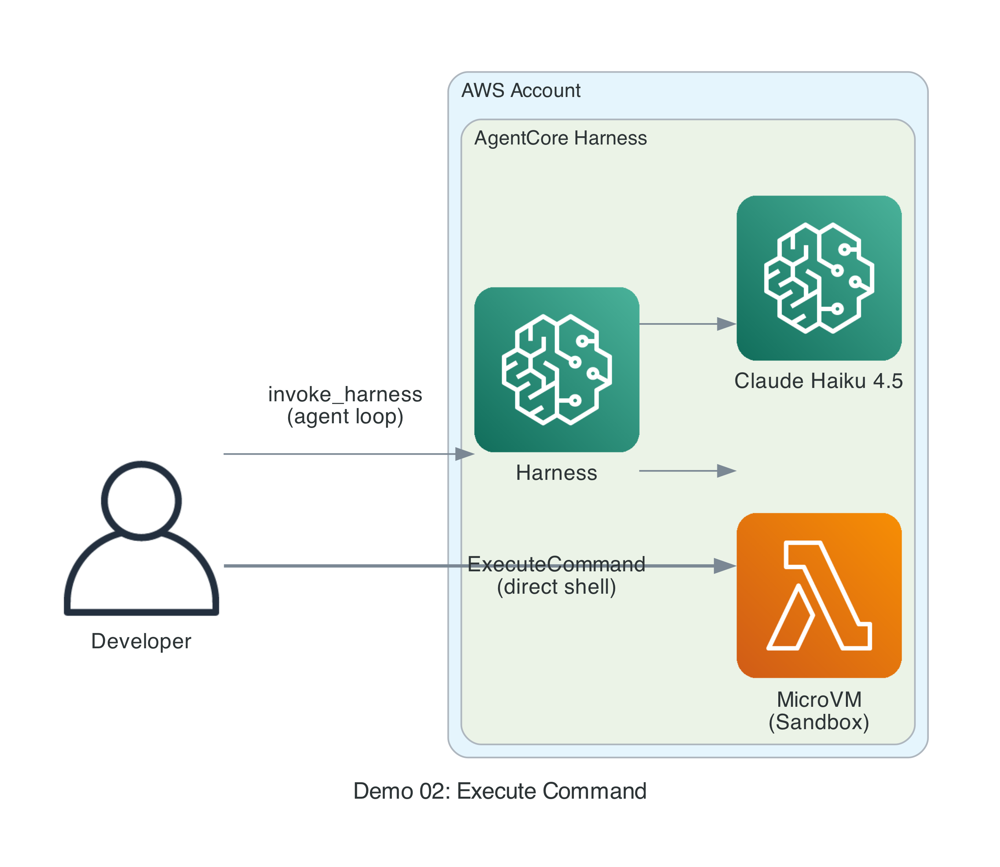
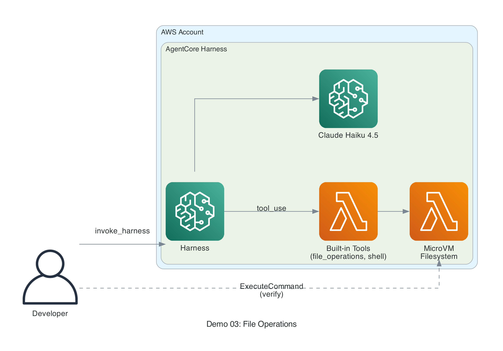
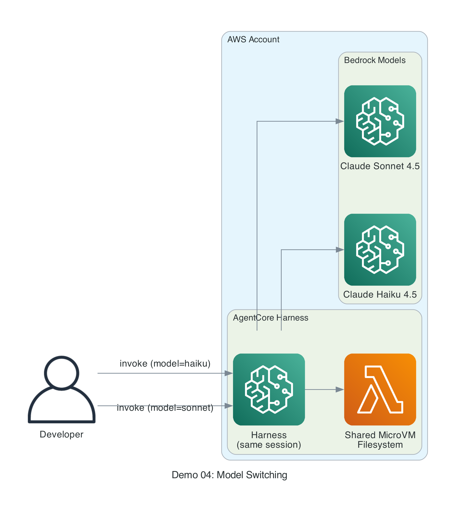
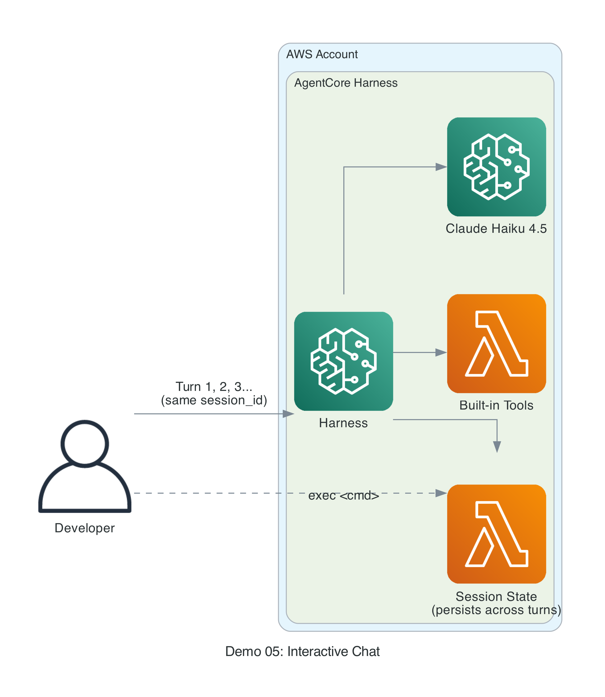

# Module 07: AgentCore Harness — Instructor Demos

Five hands-on CLI demonstrations covering the AgentCore Harness — a fully managed agent loop where you declare the model, tools, and system prompt in API calls. No orchestration code required.

## Demo Overview

| # | Demo | Key Concepts | Dependencies |
|---|------|--------------|--------------|
| 1 | [Getting Started](demo-01-getting-started/) | Create harness, invoke with prompt, stream response, cleanup | CFN stack |
| 2 | [Execute Command](demo-02-execute-command/) | Run shell commands on the agent's microVM (bypasses agent loop) | CFN stack |
| 3 | [File Operations](demo-03-file-operations/) | Agent writes/reads files, runs code in isolated VM | CFN stack |
| 4 | [Model Switching](demo-04-model-switching/) | Same session, different models per invocation | CFN stack |
| 5 | [Interactive Chat](demo-05-interactive-chat/) | Chatbot loop with persistent session state | CFN stack |
| 6 | [Weather Agent (Capstone)](demo-06-weather-agent/) | Harness + Gateway + Guardrails + Observability + Evaluations | CFN stack |

## Architecture Diagrams

| Demo | Diagram |
|------|---------|
| Demo 1 |  |
| Demo 2 |  |
| Demo 3 |  |
| Demo 4 |  |
| Demo 5 |  |

To regenerate: `cd diagrams && python generate_diagrams.py`

---

## Prerequisites

### Software Requirements

| Tool | Version | Purpose |
|------|---------|---------|
| Python | 3.12+ | Scripts and agent code |
| AWS CLI | v2 | Configured with credentials |
| boto3 | ≥1.38.0 | AWS SDK |

```bash
python3 -m venv venv
source venv/bin/activate
pip install boto3
```

### Set your AWS region

```bash
export AWS_DEFAULT_REGION=ap-southeast-1
```

### AWS Account Requirements

- Access to **Amazon Bedrock AgentCore** in your region
- Access to **Amazon Bedrock models** (Claude Haiku 4.5, Claude Sonnet 4.5)
- IAM permissions to create roles and harness resources
- Recommended region: `ap-southeast-1`

### Deploy CloudFormation Stack (REQUIRED)

All AWS resources are provisioned via CloudFormation. Deploy it first:

```bash
cd cloudformation
./deploy-stack.sh              # uses default region
./deploy-stack.sh us-west-2    # or specify region
```

This creates:
- IAM execution role for harness (with Bedrock, ECR, Logs, X-Ray, AgentCore permissions)

> **Note:** Unlike the Runtime module, Harness requires zero agent code.
> You declare model + tools at invoke time. AgentCore handles compute, sandboxing, and tool execution.

---

## Key Concepts: Harness vs Runtime

| | **Runtime** | **Harness** |
|---|---|---|
| Agent code | You write it (Strands, LangChain, etc.) | None — fully managed |
| Deployment | Package → S3 → create runtime | `create_harness` — done |
| Tool execution | Your code calls tools | AgentCore handles it |
| Compute | Your container in a microVM | Managed microVM |
| Model selection | In your agent code | Per-invocation parameter |
| Startup time | ~30-60s (cold start) | ~60-90s (first create) |

---

## Step-by-Step Demo Instructions

### Demo 1: Getting Started

**What to show the audience:**
- Creating a harness (single API call + wait for READY)
- Invoking with a prompt and streaming the response
- The agent using built-in tools (file_operations) without explicit configuration
- Cleanup via `delete_harness`

```bash
cd demo-01-getting-started
python deploy.py        # Create harness → wait for READY
python invoke.py        # Invoke with prompt, stream response
python invoke_agent.py  # Interactive chatbot (optional)
python cleanup.py       # Delete harness
```

**Talking points:**
- Zero agent code — declare model at invoke time
- Built-in tools (file_operations, shell) are always available
- Streaming response with `contentBlockDelta` events
- Harness creation takes ~60-90s; subsequent invocations are instant
- `invoke_agent.py` shows real-time chatbot with `exec` for direct shell access

---

### Demo 2: Execute Command

**What to show the audience:**
- The difference between `invoke_harness` (agent loop) and `ExecuteCommand` (direct shell)
- Running arbitrary commands on the microVM without going through the LLM
- Both share the same filesystem and session state

```bash
cd demo-02-execute-command
python deploy.py      # Create harness
python invoke.py      # Agent creates files → verify with ExecuteCommand
python cleanup.py     # Delete harness
```

**Talking points:**
- `invoke_harness` = full agent loop (LLM reasons, uses tools)
- `ExecuteCommand` = direct shell access (bypass agent, run anything)
- Use ExecuteCommand for: debugging, verification, scripted automation
- Same session_id means same VM — files from agent are visible in shell
- Stream response includes stdout, stderr, and exit_code

---

### Demo 3: File Operations

**What to show the audience:**
- Agent writing Python code, saving to files, and executing it
- Built-in `file_operations` tool (no configuration needed)
- Built-in `shell` tool for running code
- Verification via ExecuteCommand

```bash
cd demo-03-file-operations
python deploy.py      # Create harness
python invoke.py      # Agent writes Fibonacci script and runs it
python cleanup.py     # Delete harness
```

**Talking points:**
- The harness has built-in tools: `file_operations` (read/write) and `shell` (execute)
- No tool configuration required — they're always available
- The VM is isolated — files persist within the session only
- Agent can write code, run it, see output, and iterate
- This is the foundation for code-generation use cases

---

### Demo 4: Model Switching

**What to show the audience:**
- Same harness, same session — different model per invocation
- Haiku for fast/cheap tasks, Sonnet for complex/creative tasks
- Shared filesystem proves it's the same VM

```bash
cd demo-04-model-switching
python deploy.py      # Create harness
python invoke.py      # Invoke with Haiku → invoke with Sonnet → verify shared files
python cleanup.py     # Delete harness
```

**Talking points:**
- Model is a per-invocation parameter — not locked at creation time
- Use case: route simple tasks to Haiku ($), complex tasks to Sonnet ($$$)
- Session state (files, context) persists across model switches
- Both models see the same tools and filesystem
- Cost optimization: use the cheapest model that can handle the task

---

### Demo 5: Interactive Chat

**What to show the audience:**
- Multi-turn conversation with persistent state
- Agent remembers user context across turns
- Files accumulate across the session
- Interactive chatbot with `exec` for direct shell access

```bash
cd demo-05-interactive-chat
python deploy.py        # Create harness
python invoke.py        # Scripted 3-turn conversation
python invoke_agent.py  # Full interactive chatbot
python cleanup.py       # Delete harness
```

**Talking points:**
- Same session_id = persistent context + shared filesystem
- Agent remembers names, preferences, prior instructions
- `new session` command starts fresh (no memory, clean VM)
- `exec <cmd>` lets you inspect VM state without going through the agent
- This is the building block for production chatbots and coding assistants

---

### Demo 6: Weather Agent (Capstone)

**What to show the audience:**
- All 6 AgentCore features working together in one agent
- Gateway routes tool calls through Exa MCP (real-time weather data)
- Guardrail anonymizes PII in responses
- Observability traces visible in CloudWatch
- Batch evaluation scores the session with built-in evaluators
- Multi-turn conversation with persistent session state

```bash
cd demo-06-weather-agent
python deploy.py           # Create harness + gateway + guardrail (~90s)
python invoke.py           # Multi-turn weather + PII test + traces + eval
python invoke_agent.py     # Interactive chatbot (ask any weather question)
python cleanup.py          # Delete all resources
```

**Talking points:**
- This is a CAPSTONE: Harness + Gateway + Guardrails + Observability + Evaluations
- Gateway → centralized tool traffic routing + observability
- Guardrail → PII automatically anonymized (email, phone masked in output)
- Observability → every invocation generates X-Ray traces
- Evaluations → batch scoring with Helpfulness, Correctness, Coherence, Conciseness
- Zero agent code — all orchestration managed by AgentCore
- `invoke_agent.py` shows real-time weather search + `exec` for shell access

---

## Recommended Demo Order

1. **Demo 1** (4 min) — Create harness, invoke, stream response
2. **Demo 2** (3 min) — ExecuteCommand vs invoke_harness
3. **Demo 3** (4 min) — File operations and code execution
4. **Demo 4** (4 min) — Model switching within a session
5. **Demo 5** (5 min) — Interactive chat with state persistence
6. **Demo 6** (7 min) — Capstone: all features in one weather agent

**Total:** ~27 minutes

**Pro tip:** Deploy Demo 1 before class starts (harness creation takes 60-90s). Run `invoke.py` live for the audience. Use `invoke_agent.py` for interactive Q&A.

---

## Bulk Deploy / Cleanup

Deploy the stack (creates IAM role):

```bash
cd cloudformation && ./deploy-stack.sh
```

Deploy all harnesses:

```bash
for d in demo-01-getting-started demo-02-execute-command demo-03-file-operations demo-04-model-switching demo-05-interactive-chat; do
  echo "=== Deploying $d ==="
  (cd "$d" && python deploy.py)
done
```

Clean up all harnesses:

```bash
for d in demo-01-getting-started demo-02-execute-command demo-03-file-operations demo-04-model-switching demo-05-interactive-chat; do
  echo "=== Cleaning $d ==="
  (cd "$d" && python cleanup.py)
done
```

Delete the CloudFormation stack:

```bash
cd cloudformation && ./cleanup-stack.sh
```

---

## File Structure

```
demo/harness/
├── README.md                          ← This file
├── .gitignore
├── shared/
│   ├── __init__.py
│   ├── colors.py                     ← ANSI color output
│   ├── harness_helpers.py            ← Harness lifecycle + invoke helpers
│   └── stack_config.py              ← CloudFormation stack reader
├── cloudformation/
│   ├── prerequisites.yaml            ← IAM execution role
│   ├── deploy-stack.sh
│   └── cleanup-stack.sh
├── diagrams/
│   └── generate_diagrams.py          ← Generate architecture PNGs (300 DPI)
├── demo-01-getting-started/
│   ├── deploy.py                     ← Create harness
│   ├── invoke.py                     ← Invoke + stream response
│   ├── invoke_agent.py               ← Interactive chatbot
│   └── cleanup.py                    ← Delete harness
├── demo-02-execute-command/
│   ├── deploy.py                     ← Create harness
│   ├── invoke.py                     ← Agent creates files → ExecuteCommand
│   └── cleanup.py                    ← Delete harness
├── demo-03-file-operations/
│   ├── deploy.py                     ← Create harness
│   ├── invoke.py                     ← Agent writes + runs Python code
│   └── cleanup.py                    ← Delete harness
├── demo-04-model-switching/
│   ├── deploy.py                     ← Create harness
│   ├── invoke.py                     ← Haiku → Sonnet → verify shared state
│   └── cleanup.py                    ← Delete harness
└── demo-05-interactive-chat/
    ├── deploy.py                     ← Create harness
    ├── invoke.py                     ← Scripted 3-turn conversation
    ├── invoke_agent.py               ← Full interactive chatbot
    └── cleanup.py                    ← Delete harness
```

## Troubleshooting

| Issue | Solution |
|-------|----------|
| Harness stuck in CREATING | Wait up to 3-5 minutes; first creation is slower |
| `ResourceNotFoundException` | Harness may have been deleted; re-run deploy.py |
| `AccessDeniedException` | Check execution role has `bedrock:InvokeModel` permission |
| `ValidationException` with model ID | Use `global.*` prefix for harness models (NOT `apac.*`) |
| `ValidationException` with harness name | Name must match `[a-zA-Z][a-zA-Z0-9_]{0,39}` (no hyphens) |
| ExecuteCommand returns empty | Session may have expired; create new session with fresh invoke |
| `ThrottledException` | Back off and retry; request quota increase if sustained |
| Streaming returns no text | Check model ID is valid (`global.anthropic.claude-haiku-4-5-20251001-v1:0`) |
| `ServiceQuotaExceededException` | Request harness quota increase in Service Quotas |
