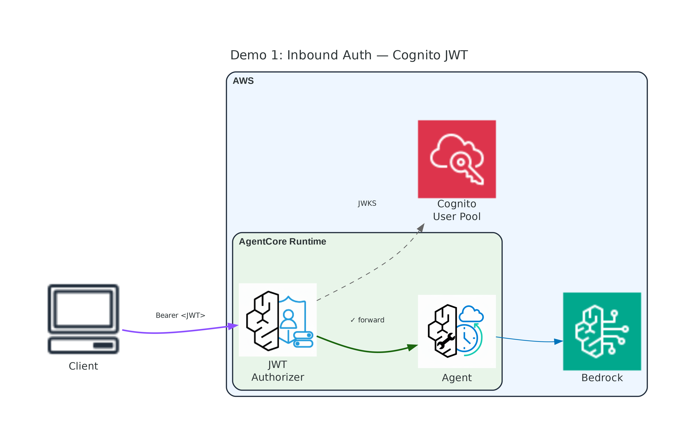
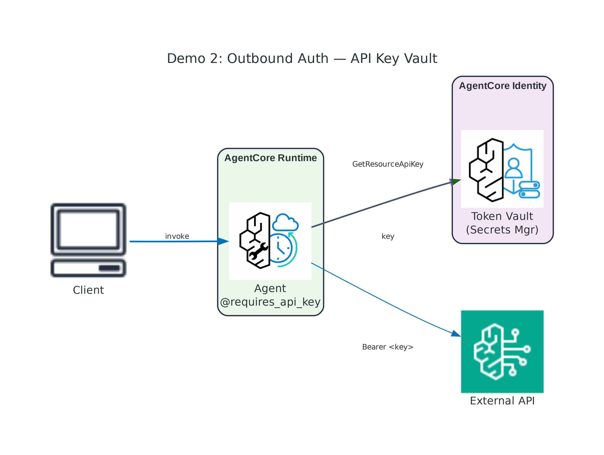
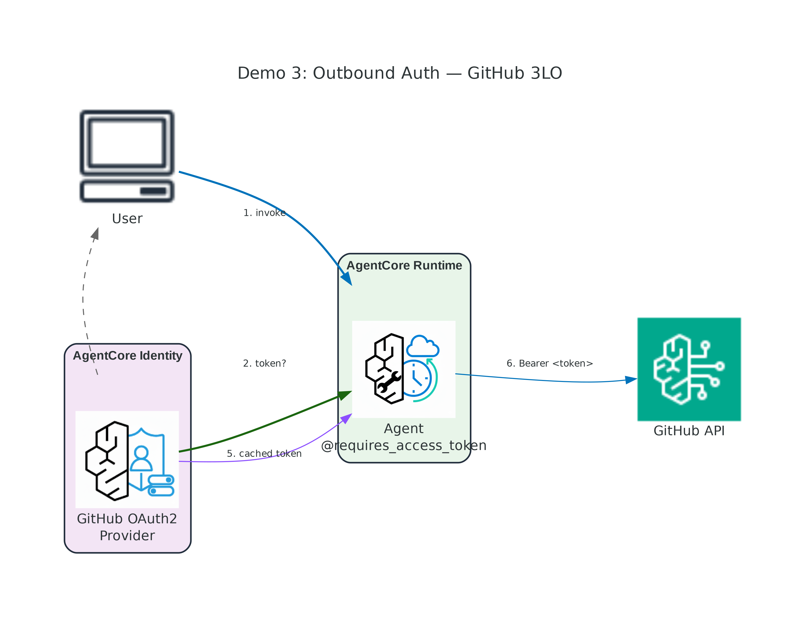
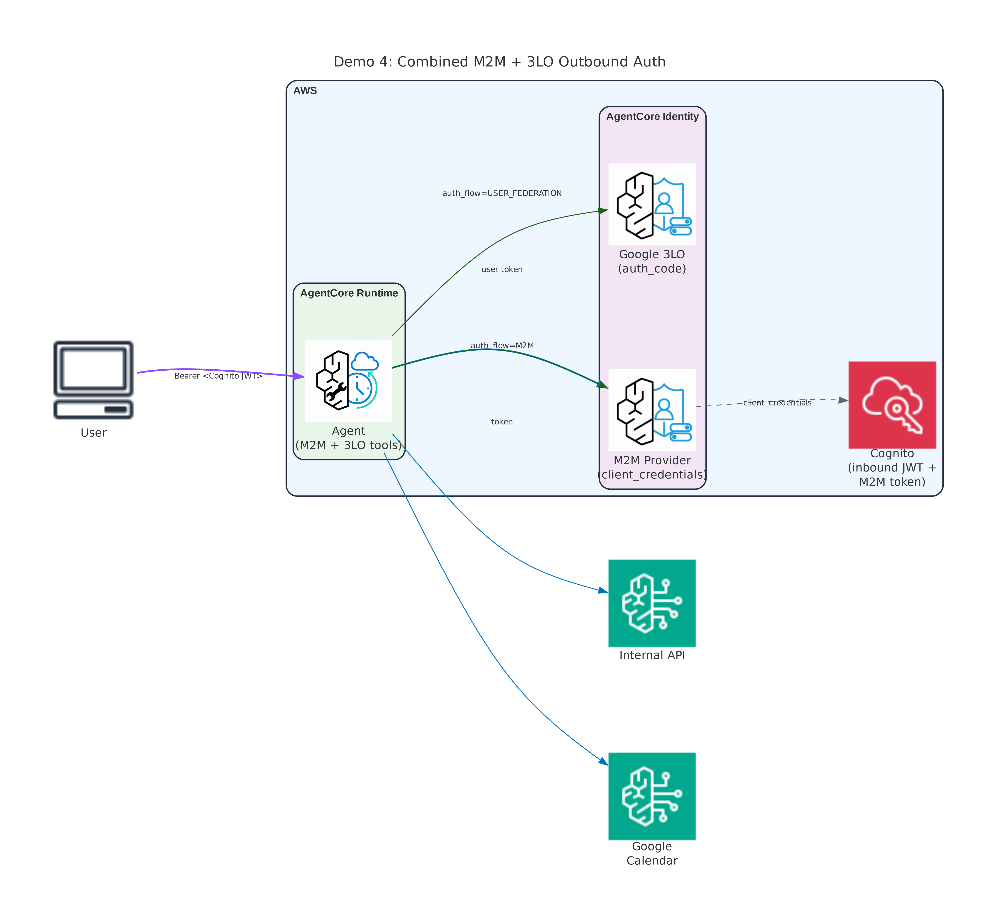
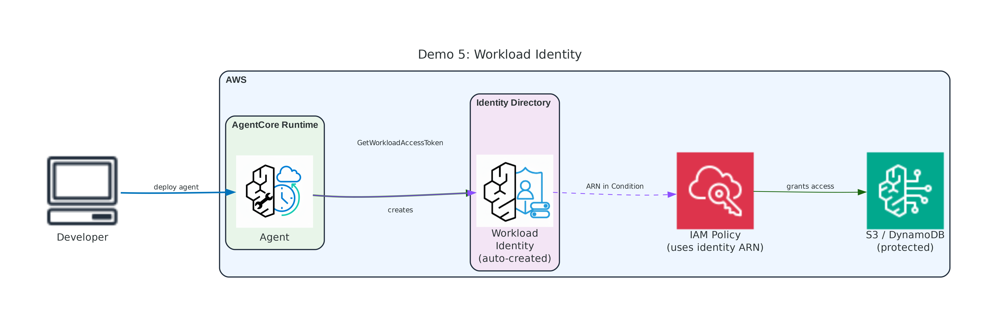

# Module 03: Security and Identity — Instructor Demos

Five hands-on CLI demonstrations for AgentCore Identity covering inbound and outbound authentication.

## Demo Overview

| # | Demo | Key Concepts | External Deps |
|---|------|--------------|---------------|
| 1 | [Inbound Auth — Cognito](demo-01-inbound-auth-cognito/) | `customJWTAuthorizer`, test rejection + success | None |
| 2 | [Outbound Auth — API Key](demo-02-outbound-auth-apikey/) | Token vault, `@requires_api_key` | API key (any string) |
| 3 | [Outbound Auth — GitHub 3LO](demo-03-outbound-auth-github/) | OAuth consent flow, `@requires_access_token` | GitHub OAuth App |
| 4 | [Combined M2M + 3LO](demo-04-combined-m2m-3lo/) | Both flows in one agent, resource server | Google OAuth2 |
| 5 | [Workload Identity](demo-05-workload-identity/) | Auto identity on deploy, identity directory | None |

## Architecture Diagrams

| Demo | Diagram |
|------|---------|
| Demo 1 |  |
| Demo 2 |  |
| Demo 3 |  |
| Demo 4 |  |
| Demo 5 |  |

To regenerate: `cd diagrams && python generate_diagrams.py`

---

## Prerequisites

### Deploy CloudFormation Stack (REQUIRED)

All AWS resources (Cognito, IAM role, S3 bucket) are provisioned via CloudFormation. Deploy it first:

```bash
cd cloudformation
./deploy-stack.sh              # uses default region
./deploy-stack.sh us-east-1    # or specify region
```

This creates:
- S3 bucket for agent code
- IAM execution role (with identity permissions)
- Cognito User Pool + domain + resource server
- User client (inbound auth) + Machine client (M2M)
- Test user: `demouser` / `DemoPass123!`

### Software Requirements

| Tool | Version | Purpose |
|------|---------|---------|
| Python | 3.12+ | Scripts and agent code |
| [uv](https://docs.astral.sh/uv/getting-started/installation/) | latest | Build arm64 packages |
| AWS CLI | v2 | Configured with credentials |
| boto3 | ≥1.38.0 | AWS SDK |

```bash
python3 -m venv venv
source venv/bin/activate
pip install boto3 bedrock-agentcore strands-agents strands-agents-tools uv
```

---

## Step-by-Step Demo Instructions

### Demo 1: Inbound Auth with Cognito

```bash
cd demo-01-inbound-auth-cognito
python deploy.py      # Deploy runtime with customJWTAuthorizer
python invoke.py      # Test: no auth → 403, with token → success
python cleanup.py     # Delete runtime (CFN resources remain)
```

**Talking points:**
- `authorizerConfiguration.customJWTAuthorizer` protects the endpoint
- AgentCore validates JWT via OIDC discovery URL (JWKS)
- Agent code has zero auth logic — separation of concerns
- Works with any OIDC provider: Cognito, Entra ID, Okta

---

### Demo 2: Outbound Auth — API Key

```bash
cd demo-02-outbound-auth-apikey
export DEMO_API_KEY="sk-any-test-string-here"
python deploy.py      # Creates credential provider + deploys runtime
python invoke.py      # Agent retrieves key from vault via @requires_api_key
python cleanup.py     # Deletes provider + runtime
```

**Talking points:**
- `@requires_api_key(provider_name="...")` injects the key at runtime
- Key stored in Secrets Manager — never in code or LLM context
- Key rotation: update provider → next call gets new key

---

### Demo 3: Outbound Auth — GitHub 3LO

```bash
cd demo-03-outbound-auth-github
export GITHUB_CLIENT_ID="..."
export GITHUB_CLIENT_SECRET="..."
python deploy.py      # Creates GitHub OAuth2 provider + deploys runtime
python invoke.py      # First call returns consent URL
python cleanup.py     # Deletes provider + runtime
```

**Talking points:**
- `@requires_access_token(auth_flow="USER_FEDERATION")` triggers consent
- One-time consent → token cached → automatic thereafter
- Delegation, not impersonation: agent acts ON BEHALF OF user

---

### Demo 4: Combined M2M + 3LO

```bash
cd demo-04-combined-m2m-3lo
export GOOGLE_CLIENT_ID="..."       # optional for Google Calendar
export GOOGLE_CLIENT_SECRET="..."
python deploy.py      # M2M provider (Cognito) + Google 3LO provider
python invoke.py      # Tests both M2M and 3LO flows
python cleanup.py     # Deletes providers + runtime
```

**Talking points:**
- M2M: agent authenticates as itself (client_credentials) — automated
- 3LO: agent acts on behalf of user (authorization_code) — consent
- Both coexist in one agent via different `auth_flow` values
- Inbound auth also enabled (Cognito JWT required to invoke)

---

### Demo 5: Workload Identity

```bash
cd demo-05-workload-identity
python deploy.py      # Deploys agent → automatic workload identity
python invoke.py      # Standard invocation
python cleanup.py     # Deletes runtime (identity auto-deleted)
```

**Talking points:**
- Deploying to Runtime → automatic workload identity creation
- `list-workload-identities` shows all agent identities
- Use the ARN in IAM policies for fine-grained access control
- For self-hosted agents: create identities manually via API

---

## Recommended Demo Order

1. **Demo 1** (5 min) — Inbound auth (self-contained)
2. **Demo 5** (4 min) — Workload identity (self-contained)
3. **Demo 2** (3 min) — API key vault
4. **Demo 3** (5 min) — GitHub OAuth consent flow
5. **Demo 4** (5 min) — Combined flows (if credentials prepared)

**Total:** ~22 minutes

---

## Cleanup

```bash
# Delete all runtimes
for d in demo-01-inbound-auth-cognito demo-02-outbound-auth-apikey demo-03-outbound-auth-github demo-04-combined-m2m-3lo demo-05-workload-identity; do
  (cd "$d" && python cleanup.py 2>/dev/null)
done

# Delete CloudFormation stack (removes Cognito, IAM, S3)
cd cloudformation && ./cleanup-stack.sh
```

---

## File Structure

```
demo/identity/
├── README.md
├── .gitignore
├── cloudformation/
│   ├── prerequisites.yaml         ← All AWS resources (Cognito, IAM, S3)
│   ├── deploy-stack.sh
│   └── cleanup-stack.sh
├── shared/
│   ├── __init__.py
│   ├── colors.py                  ← ANSI color output
│   ├── stack_config.py            ← Reads CFN outputs
│   └── deploy_helpers.py          ← Build/upload/create runtime/cleanup
├── diagrams/
│   └── generate_diagrams.py
├── demo-01-inbound-auth-cognito/
│   ├── agent.py, requirements.txt
│   ├── deploy.py, invoke.py, cleanup.py
├── demo-02-outbound-auth-apikey/
│   ├── agent.py, requirements.txt
│   ├── deploy.py, invoke.py, cleanup.py
├── demo-03-outbound-auth-github/
│   ├── agent.py, requirements.txt
│   ├── deploy.py, invoke.py, cleanup.py
├── demo-04-combined-m2m-3lo/
│   ├── agent.py, requirements.txt
│   ├── deploy.py, invoke.py, cleanup.py
└── demo-05-workload-identity/
    ├── agent.py, requirements.txt
    ├── deploy.py, invoke.py, cleanup.py
```

## Troubleshooting

| Issue | Solution |
|-------|----------|
| "Could not read stack" error | Deploy CFN first: `cd cloudformation && ./deploy-stack.sh` |
| AccessDeniedException with valid token | Check `allowedClients` matches the Cognito client ID |
| Token expired | Cognito tokens expire after 2 hours; deploy-stack creates a fresh user |
| Credential provider "already exists" | Scripts handle this gracefully; use cleanup.py if needed |
| Runtime CREATE_FAILED | IAM propagation — wait 15s and retry (scripts do this automatically) |
