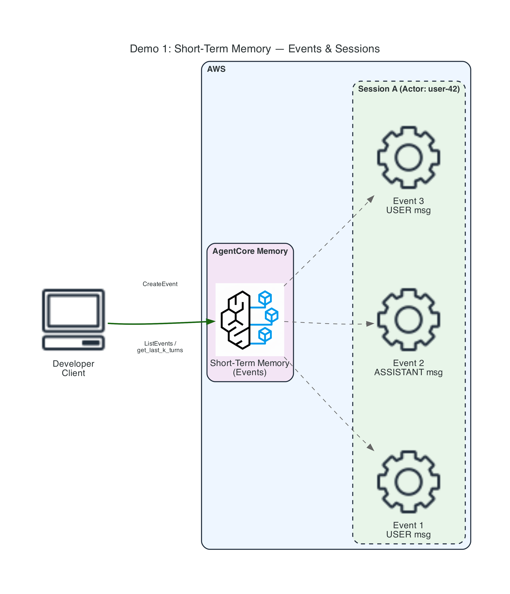
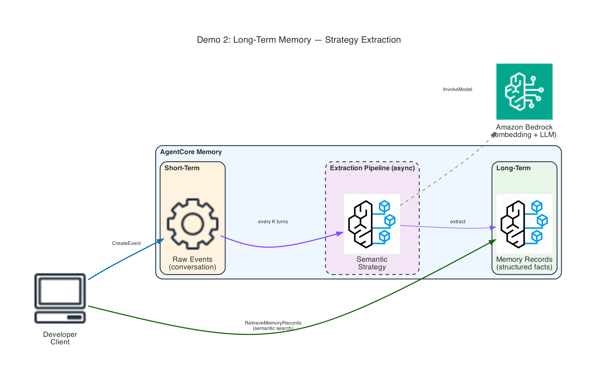
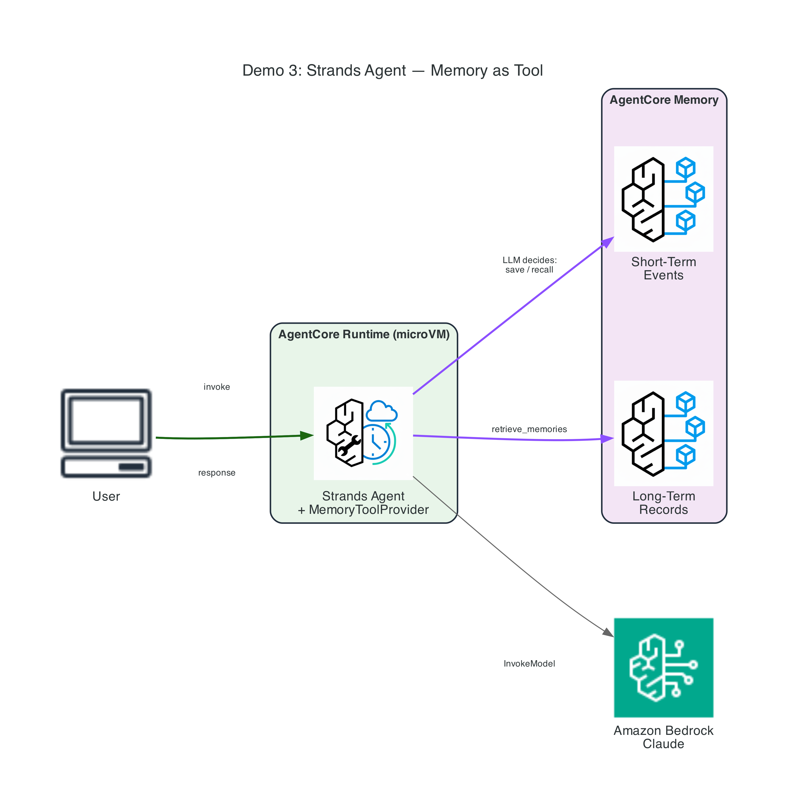
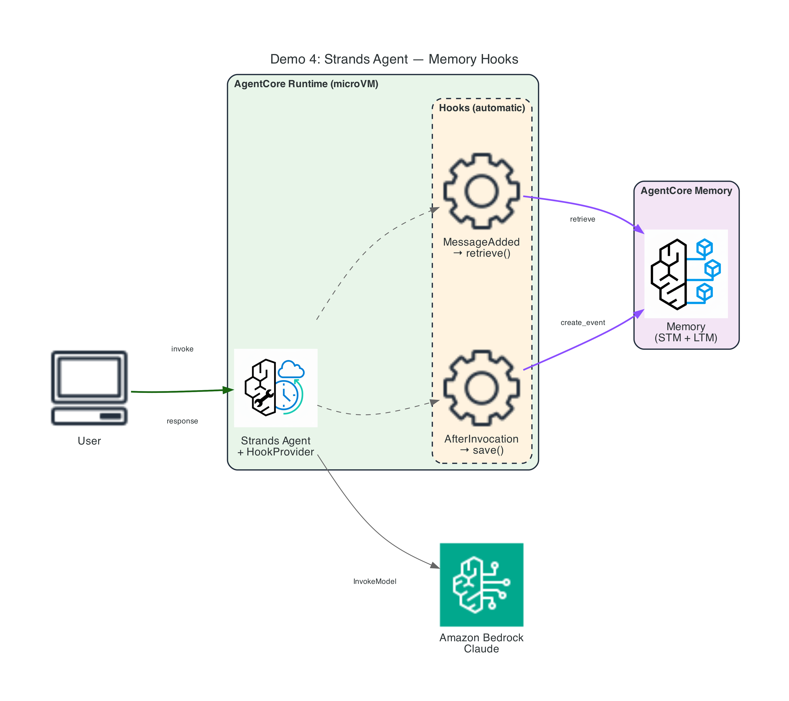
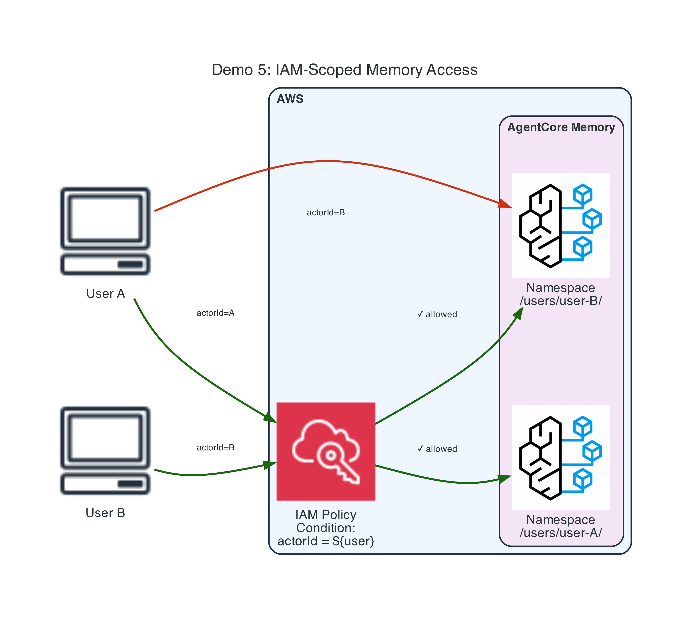

# Module 05: AgentCore Memory — Instructor Demos

Five hands-on CLI demonstrations covering short-term memory, long-term memory extraction, Strands integration patterns, and IAM security.

## Demo Overview

| # | Demo | Key Concepts | Dependencies |
|---|------|--------------|--------------|
| 1 | [Short-Term Memory](demo-01-short-term-memory/) | Events, actors, sessions, `CreateEvent`, `ListEvents`, `get_last_k_turns` | None |
| 2 | [Long-Term Memory](demo-02-long-term-memory/) | Strategies, async extraction, semantic search, namespaces | None |
| 3 | [Strands — Memory as Tool](demo-03-strands-memory-tools/) | `AgentCoreMemoryToolProvider`, LLM decides when to save/recall | None |
| 4 | [Strands — Memory Hooks](demo-04-strands-memory-hooks/) | `HookProvider`, `MessageAddedEvent`, `AfterInvocationEvent` | None |
| 5 | [IAM Scoped Access](demo-05-iam-scoped-access/) | `bedrock-agentcore:actorId` condition, tenant isolation | None |

## Architecture Diagrams

| Demo | Diagram |
|------|---------|
| Demo 1 |  |
| Demo 2 |  |
| Demo 3 |  |
| Demo 4 |  |
| Demo 5 |  |

To regenerate: `cd diagrams && python generate_diagrams.py`

---

## Prerequisites

### Software Requirements

| Tool | Version | Purpose |
|------|---------|---------|
| Python | 3.12+ | Scripts and agent code |
| AWS CLI | v2 | Configured with credentials |
| boto3 | ≥1.38.0 | AWS SDK |

```bash
python3 -m venv venv
source venv/bin/activate
pip install boto3 bedrock-agentcore strands-agents strands-agents-tools
```

### Set your AWS region

```bash
export AWS_DEFAULT_REGION=ap-southeast-1
```

### AWS Account Requirements

- Access to **Amazon Bedrock AgentCore** in your region
- Access to **Amazon Bedrock models** (Claude Haiku 4.5, Titan Embed Text v2)
- IAM permissions to create roles, S3 buckets, and memory resources
- Recommended region: `ap-southeast-1`, `us-east-1`, or `us-west-2`

### Deploy CloudFormation Stack (REQUIRED)

All AWS resources are provisioned via CloudFormation. Deploy it first:

```bash
cd cloudformation
./deploy-stack.sh              # uses default region
./deploy-stack.sh us-west-2    # or specify region
```

This creates:
- S3 bucket for agent code
- IAM runtime execution role (with Memory + Bedrock permissions)
- IAM memory execution role (for strategy extraction pipeline)
- IAM scoped roles for user-A and user-B (Demo 5)
- AgentCore Memory resource: STM-only (Demo 1)
- AgentCore Memory resource: with semantic strategy (Demos 2, 4, 5)
- AgentCore Memory resource: with user preference strategy (Demo 3)

> **Note:** Demos 3-4 run locally (no runtime deployment needed).
> All AWS resources are managed by the CloudFormation stack.

---

## Step-by-Step Demo Instructions

### Demo 1: Short-Term Memory (Events & Sessions)

**What to show the audience:**
- Creating a memory resource (STM-only, no strategies)
- Writing conversation events with `CreateEvent`
- Retrieving events with `ListEvents` and `get_last_k_turns`
- Actor and session isolation (no cross-user data leakage)

```bash
cd demo-01-short-term-memory
python deploy.py      # Create memory resource (STM only)
python invoke.py      # Write events, list, retrieve, test isolation
python cleanup.py     # Delete memory + IAM roles
```

**Talking points:**
- Events are the raw building blocks — immutable, timestamped turns
- `actorId` + `sessionId` scope all operations
- `get_last_k_turns` is the ergonomic way to reload conversation context
- No extraction, no embeddings — immediate low-latency access
- `eventExpiryDuration` controls how long events persist (3-365 days)

---

### Demo 2: Long-Term Memory (Strategy Extraction)

**What to show the audience:**
- Creating a memory with a semantic strategy
- Writing events that trigger asynchronous extraction
- Waiting ~90s for the background pipeline
- Retrieving structured memory records via semantic search
- Namespace organization with `{actorId}` templates

```bash
cd demo-02-long-term-memory
python deploy.py      # Create memory with semantic strategy
python invoke.py      # Write events → wait → retrieve records
python cleanup.py     # Delete memory + IAM roles
```

**Talking points:**
- Strategies transform raw events into structured, reusable records
- Extraction is async — runs every K turns in the background
- Semantic search finds records by meaning, not exact match
- Namespace `/users/{actorId}/facts/` isolates per-user knowledge
- Each strategy is a separate Bedrock model invocation (cost consideration)
- Four built-in: Semantic, Summary, User Preference, Episodic

---

### Demo 3: Strands Agent — Memory as Tool

**What to show the audience:**
- `AgentCoreMemoryToolProvider` gives the agent explicit memory tools
- The LLM decides WHEN to recall/save (deliberate memory access)
- Multi-turn conversation where agent stores and retrieves preferences

```bash
cd demo-03-strands-memory-tools
python deploy.py      # Verify memory resource is active (no runtime needed)
python invoke.py      # Scripted demo: save + recall (runs locally)
python invoke_agent.py # Interactive chatbot with memory tools
```

**Talking points:**
- Memory-as-tool = agent has explicit control over memory operations
- LLM sees memory tools in its tool list and decides when to use them
- Good for: selective storage, complex recall queries, debugging
- Compare with Demo 4: tool = explicit; hook = automatic
- User preference strategy captures patterns in behavior/choices
- Runs locally — no runtime deployment delays, no 30s init timeout

---

### Demo 4: Strands Agent — Memory Hooks

**What to show the audience:**
- `HookProvider` with `MessageAddedEvent` and `AfterInvocationEvent`
- Memory operations fire automatically at lifecycle events
- No explicit tool calls — transparent to the LLM
- Compare with Demo 3 for the two integration patterns

```bash
cd demo-04-strands-memory-hooks
python deploy.py      # Verify memory resource is active (no runtime needed)
python invoke.py      # Scripted demo: save + recall (runs locally)
python invoke_agent.py # Interactive chatbot with memory hooks
```

**Talking points:**
- Hooks fire at specific lifecycle points — no LLM involvement
- `MessageAdded` → retrieve relevant context before first LLM call
- `AfterInvocation` → save the turn after the agent responds
- Good for: standard save/retrieve lifecycle, consistent behavior
- Graceful degradation: memory failure never breaks the agent turn
- Three Strands patterns: built-in hook, custom hook, memory-as-tool
- Runs locally — hooks simulated with explicit SDK calls before/after each turn

---

### Demo 5: IAM-Scoped Memory Access

**What to show the audience:**
- Creating IAM policies with `bedrock-agentcore:actorId` condition
- Role A can read user-A's memory — but NOT user-B's
- Role B can read user-B's memory — but NOT user-A's
- Demonstrates tenant isolation at the IAM level

```bash
cd demo-05-iam-scoped-access
python deploy.py      # Create memory + scoped IAM roles + seed data
python invoke.py      # Test: allowed vs denied access patterns
python cleanup.py     # Delete memory + all IAM roles
```

**Talking points:**
- Fine-grained access via IAM context keys: `actorId`, `sessionId`, `namespace`
- Namespaces are ORGANIZATION — IAM is the security BOUNDARY
- Each role gets only the actions and scope it needs (least privilege)
- Short-term: scoped by `actorId` + `sessionId`
- Long-term: scoped by `namespace` + `strategyId`
- Prefer federated short-lived credentials for user-facing paths

---

## Recommended Demo Order

1. **Demo 1** (4 min) — Short-term memory fundamentals
2. **Demo 2** (5 min) — Long-term extraction (start early — 60s wait)
3. **Demo 3** (5 min) — Memory as tool (agent decides)
4. **Demo 4** (4 min) — Memory hooks (automatic, compare with Demo 3)
5. **Demo 5** (4 min) — IAM security (allow/deny demonstration)

**Total:** ~22 minutes

**Pro tip:** Deploy Demos 1-2 before class starts (the 60s extraction wait is dead time in a live demo). Run `invoke.py` live for the audience.

---

## Bulk Deploy / Cleanup

Deploy the stack (creates all AWS resources):

```bash
cd cloudformation && ./deploy-stack.sh
```

Verify resources for Demos 3-4 (runs locally, no runtime needed):

```bash
for d in demo-03-strands-memory-tools demo-04-strands-memory-hooks; do
  echo "=== Verifying $d ==="
  (cd "$d" && python deploy.py)
done
```

Seed data for Demo 5:

```bash
(cd demo-05-iam-scoped-access && python deploy.py)
```

Clean up Demos 3-4 (no-op since they run locally; memory stays in stack):

```bash
for d in demo-03-strands-memory-tools demo-04-strands-memory-hooks; do
  echo "=== Cleaning $d ==="
  (cd "$d" && python cleanup.py)
done
```

Delete everything (stack + all resources):

```bash
cd cloudformation && ./cleanup-stack.sh
```

---

## Architecture

All AWS resources are provisioned via CloudFormation. Demos 3-4 run locally (no runtime deployment needed).

```
1. Deploy CFN stack (creates Memory resources, IAM roles, S3)
2. python deploy.py   (verifies resources are ACTIVE)
3. python invoke.py   (exercises memory operations — Demos 3-4 run locally)
4. python cleanup.py  (no-op for Demos 3-4; memory stays in stack)
5. Delete CFN stack when done with all demos
```

---

## File Structure

```
demo/memory/
├── README.md                          ← This file
├── .gitignore
├── shared/
│   ├── __init__.py
│   ├── colors.py                     ← ANSI color output
│   ├── deploy_helpers.py             ← Memory + Runtime lifecycle helpers
│   └── local_test.py                 ← Local HTTP test utility
├── cloudformation/
│   ├── prerequisites.yaml            ← Optional: S3 + IAM roles
│   ├── deploy-stack.sh
│   └── cleanup-stack.sh
├── diagrams/
│   ├── generate_diagrams.py          ← Generate architecture PNGs (300 DPI)
│   ├── demo-01-architecture.png
│   ├── demo-02-architecture.png
│   ├── demo-03-architecture.png
│   ├── demo-04-architecture.png
│   └── demo-05-architecture.png
├── demo-01-short-term-memory/
│   ├── agent.py                      ← Simple travel assistant
│   ├── requirements.txt
│   ├── local_test.py
│   ├── deploy.py                     ← Creates memory (STM only)
│   ├── invoke.py                     ← Write/read events, test isolation
│   └── cleanup.py
├── demo-02-long-term-memory/
│   ├── agent.py                      ← Agent with long-term recall
│   ├── requirements.txt
│   ├── local_test.py
│   ├── deploy.py                     ← Creates memory with semantic strategy
│   ├── invoke.py                     ← Write → wait → retrieve records
│   └── cleanup.py
├── demo-03-strands-memory-tools/
│   ├── agent.py                      ← Reference only (runs locally)
│   ├── requirements.txt
│   ├── local_test.py
│   ├── deploy.py                     ← Verifies memory resource is ACTIVE
│   ├── invoke.py                     ← Scripted demo: save + recall (local)
│   ├── invoke_agent.py               ← Interactive chatbot (local)
│   └── cleanup.py
├── demo-04-strands-memory-hooks/
│   ├── agent.py                      ← Reference only (runs locally)
│   ├── requirements.txt
│   ├── local_test.py
│   ├── deploy.py                     ← Verifies memory resource is ACTIVE
│   ├── invoke.py                     ← Scripted demo: hooks (local)
│   ├── invoke_agent.py               ← Interactive chatbot (local)
│   └── cleanup.py
└── demo-05-iam-scoped-access/
    ├── agent.py                      ← Not deployed (SDK-only demo)
    ├── requirements.txt
    ├── local_test.py
    ├── deploy.py                     ← Creates memory + scoped IAM roles
    ├── invoke.py                     ← Tests allowed vs denied access
    └── cleanup.py
```

## Troubleshooting

| Issue | Solution |
|-------|----------|
| Memory stuck in CREATING | Wait up to 5 minutes; check IAM role permissions |
| No records after extraction | Wait at least 60s; extraction is async. Try running invoke.py again |
| `ResourceNotFoundException` | Memory resource may have been deleted; re-run deploy.py |
| `AccessDeniedException` | Check IAM role has correct permissions and actorId conditions |
| `ThrottledException` | Back off and retry; request quota increase if sustained |
| `ServiceQuotaExceededException` | Request quota increase in Service Quotas console |
| Memory execution role errors | Role needs `bedrock:InvokeModel` for extraction strategies |
