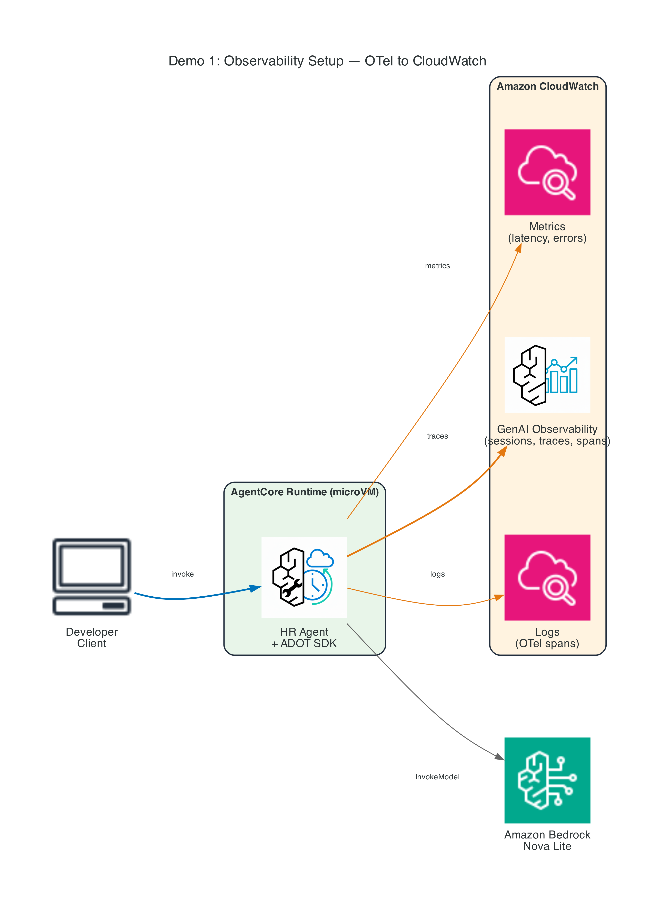
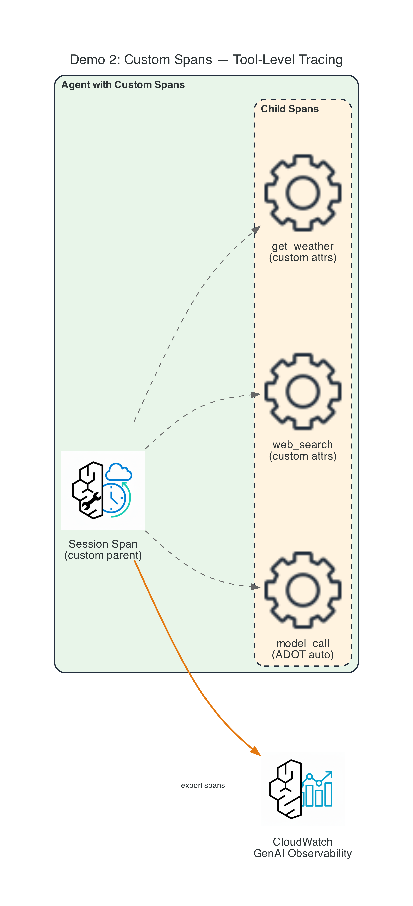
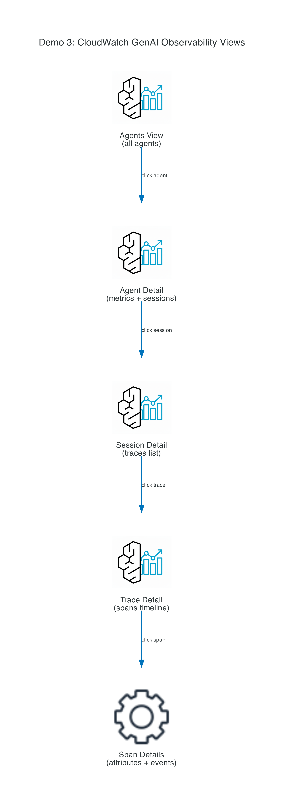
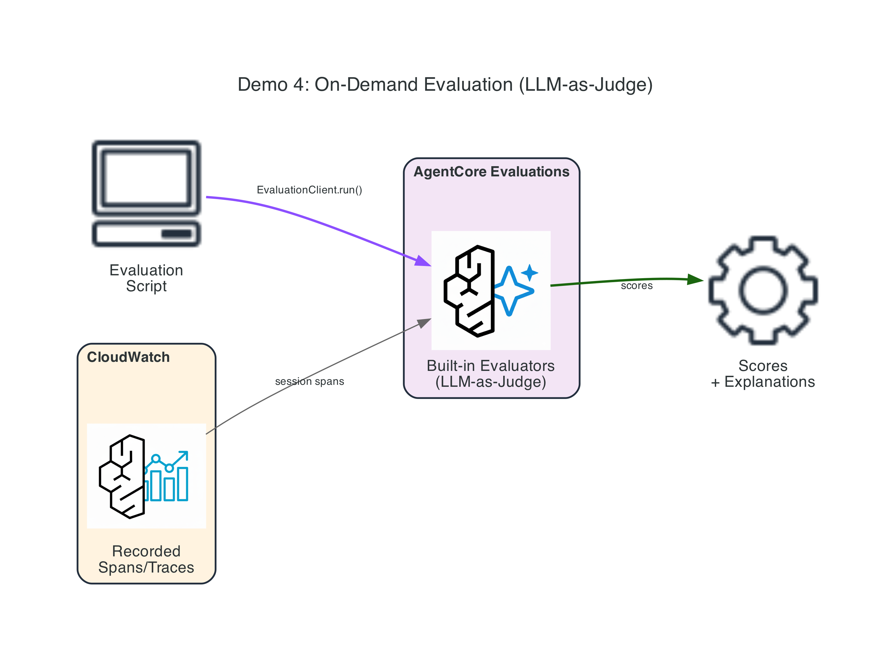
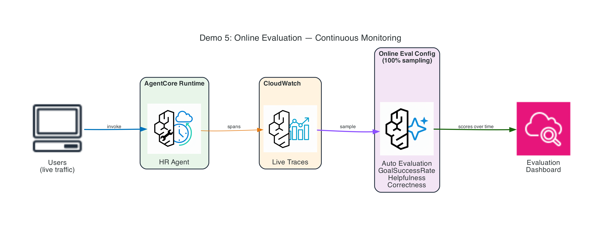

# Module 06: Production Monitoring & Observability — Instructor Demos

Five hands-on demonstrations covering AgentCore Observability (OTel instrumentation, CloudWatch integration, custom spans) and AgentCore Evaluations (on-demand and online).

## Demo Overview

| # | Demo | Key Concepts | Dependencies |
|---|------|--------------|--------------|
| 1 | [Observability Setup](demo-01-observability-setup/) | `opentelemetry-instrument`, ADOT SDK, X-Ray, sessions/traces/spans | CFN stack |
| 2 | [Custom Spans](demo-02-custom-spans/) | `tracer.start_as_current_span`, attributes, events, span hierarchy | Local run |
| 3 | [CloudWatch Dashboard](demo-03-cloudwatch-dashboard/) | Agents view, Agent detail, Session, Trace, Span views | Demo 1 |
| 4 | [On-Demand Evaluation](demo-04-on-demand-evaluation/) | `EvaluationClient`, built-in evaluators, LLM-as-a-Judge scoring | Demo 1 |
| 5 | [Online Evaluation](demo-05-online-evaluation/) | `create_online_evaluation_config`, continuous monitoring, sampling | Demo 1 + CFN |

## Architecture Diagrams

| Demo | Diagram |
|------|---------|
| Demo 1 |  |
| Demo 2 |  |
| Demo 3 |  |
| Demo 4 |  |
| Demo 5 |  |

To regenerate: `cd diagrams && python generate_diagrams.py`

---

## Prerequisites

### Software Requirements

| Tool | Version | Purpose |
|------|---------|---------|
| Python | 3.12+ | Scripts and agent code |
| AWS CLI | v2 | Configured with credentials |
| boto3 | ≥1.38.0 | AWS SDK |
| bedrock-agentcore | ≥1.18.0 | AgentCore SDK (includes evaluation) |

```bash
python3 -m venv venv
source venv/bin/activate
pip install boto3 "bedrock-agentcore>=1.18.0" "strands-agents[otel]" aws-opentelemetry-distro
```

### Set your AWS region

```bash
export AWS_DEFAULT_REGION=ap-southeast-1
```

### AWS Account Requirements

- Access to **Amazon Bedrock AgentCore** in your region
- Access to **Amazon Bedrock models** (Nova Lite — `apac.amazon.nova-lite-v1:0` in ap-southeast-1)
- **CloudWatch Transaction Search enabled** (one-time per account/region)

### Deploy CloudFormation Stack (REQUIRED)

```bash
cd cloudformation
./deploy-stack.sh              # uses default region
./deploy-stack.sh ap-southeast-1
```

This creates:
- S3 bucket for agent code
- IAM runtime execution role (with OTel, X-Ray, CloudWatch permissions)
- IAM evaluation execution role (for online eval service)

### Enable CloudWatch Transaction Search (REQUIRED, one-time)

Traces won't appear until Transaction Search is enabled:

1. Open [CloudWatch → X-Ray settings → Transaction Search](https://console.aws.amazon.com/cloudwatch/home#xray:settings/transaction-search)
2. Click **Enable Transaction Search**
3. Wait ~10 minutes for setup to complete

---

## Architecture

```
1. Deploy CFN stack (creates S3, IAM roles)
2. Enable CloudWatch Transaction Search (one-time, console)
3. python deploy.py   (deploys agent with OTel to AgentCore Runtime)
4. python invoke.py   (sends prompts → traces flow to CloudWatch)
5. python cleanup.py  (deletes runtime; CFN resources remain)
6. Delete CFN stack when done with all demos
```

---

## Step-by-Step Demo Instructions

### Demo 1: Observability Setup (Deploy Agent with OTel)

**What to show the audience:**
- The `opentelemetry-instrument` entry point wrapping the agent
- `aws-opentelemetry-distro` in requirements.txt
- ADOT auto-instruments Bedrock calls, Strands tools, agent lifecycle
- Traces flowing to CloudWatch GenAI Observability

```bash
cd demo-01-observability-setup
python deploy.py      # Build + deploy with OTel instrumentation (~3 min)
python invoke.py      # Send HR prompts → traces to CloudWatch
python cleanup.py     # Delete runtime (when done with all demos)
```

**Talking points:**
- Key requirement: `entryPoint: ["opentelemetry-instrument", "agent.py"]`
- ADOT auto-captures: model calls, tool invocations, agent lifecycle
- IAM role needs: CloudWatch Logs, X-Ray, CloudWatch Metrics permissions
- No code changes to the agent — instrumentation is external
- CloudWatch Transaction Search must be enabled first

---

### Demo 2: Custom Spans (Advanced Instrumentation)

**What to show the audience:**
- Creating custom spans with `tracer.start_as_current_span()`
- Adding attributes: `span.set_attribute("search.query", query)`
- Recording events: `span.add_event("search_started")`
- Span hierarchy: session → web_search → get_weather

```bash
cd demo-02-custom-spans
pip install -r requirements.txt
cp .env.example .env    # Edit region if needed
python deploy.py        # Setup instructions
opentelemetry-instrument python custom_span_creation.py --session-id "demo-001"
```

**Talking points:**
- Custom spans go BEYOND automatic ADOT instrumentation
- Use for: business-specific operations, tool calls, decision points
- Attributes visible in CloudWatch trace detail → span detail
- Events mark significant moments within a span
- Always set span status (OK or ERROR) for proper visualization
- Follow GenAI Semantic Conventions for attribute naming

---

### Demo 3: CloudWatch Dashboard (Console Tour)

**What to show the audience:**
- Navigate: Agents View → Agent Detail → Session → Trace → Span
- Show the hierarchy: Session > Trace > Span > Sub-Span
- Timeline view (duration visualization)
- Trajectory view (execution flow)
- Span details (attributes, events, error status)

```bash
cd demo-03-cloudwatch-dashboard
python deploy.py      # Instructions only
python invoke.py      # Programmatically query traces
```

**Talking points:**
- Agents View: all agents, session count, error rate
- Agent Detail: FM token usage, errors by span, throttles
- Session Detail: list of traces with latency
- Trace Detail: span count, P95 latency, start/end time
- Timeline: identify longest-running operations
- Trajectory: understand interconnected execution flow
- This is best as a LIVE console walkthrough

---

### Demo 4: On-Demand Evaluation (LLM-as-a-Judge)

**What to show the audience:**
- `EvaluationClient.run()` scores recorded sessions
- Built-in evaluators: GoalSuccessRate, Helpfulness, Correctness
- Results: numeric score + label + explanation
- Evaluates from CloudWatch spans (no live agent call needed)

```bash
cd demo-04-on-demand-evaluation
python deploy.py      # Instructions (uses Demo 1 runtime)
python invoke.py      # Invoke → wait 90s → evaluate → show scores
```

**Talking points:**
- On-demand = targeted assessment of specific sessions
- Use for: debugging, CI/CD spot-checks, validating fixes
- 13 built-in evaluators covering quality, safety, accuracy
- TRACE-level (per turn): Correctness, Helpfulness, Faithfulness
- SESSION-level (per conversation): GoalSuccessRate, ToolSelectionAccuracy
- Requires spans to be in CloudWatch first (~90s ingestion delay)

---

### Demo 5: Online Evaluation (Continuous Monitoring)

**What to show the audience:**
- `create_online_evaluation_config` for persistent scoring
- Sampling rate controls what percentage gets evaluated
- Scores appear in CloudWatch GenAI Observability → Evaluations tab
- No per-session API call needed — automatic after configuration

```bash
cd demo-05-online-evaluation
python deploy.py      # Create online eval config (immediate)
python invoke.py      # Send live traffic to trigger evaluation
python cleanup.py     # Disable + delete the config
```

**Talking points:**
- Online eval = continuous production monitoring
- Configure once → every sampled session scored automatically
- Sampling: 100% for demo, lower (10-25%) for high-traffic production
- Results flow to CloudWatch; set alarms on quality regression
- Use for: catching degradation, A/B testing, trend monitoring
- Compare with Demo 4: on-demand is reactive; online is proactive

---

## Recommended Demo Order

1. **Demo 1** (5 min) — Deploy with OTel, show traces flowing
2. **Demo 3** (5 min) — Console tour of CloudWatch views (while traces load)
3. **Demo 2** (4 min) — Custom spans for deeper visibility
4. **Demo 4** (5 min) — On-demand evaluation (start early — 90s wait)
5. **Demo 5** (4 min) — Online evaluation (create config + trigger)

**Total:** ~23 minutes

**Pro tip:** Deploy Demo 1 before class. Run invoke.py to generate traces. Then during class, start with Demo 3 (console tour) while Demo 4's invocations ingest.

---

## Bulk Deploy / Cleanup

```bash
# Deploy stack + Demo 1
cd cloudformation && ./deploy-stack.sh
cd ../demo-01-observability-setup && python deploy.py

# Generate traffic for Demos 3-5
python invoke.py

# When done:
cd ../demo-05-online-evaluation && python cleanup.py
cd ../demo-01-observability-setup && python cleanup.py
cd ../cloudformation && ./cleanup-stack.sh
```

---

## File Structure

```
demo/observability/
├── README.md
├── .gitignore
├── shared/
│   ├── __init__.py
│   ├── colors.py                     ← ANSI color output
│   ├── deploy_helpers.py             ← Runtime deploy with OTel
│   ├── stack_config.py               ← Read CFN outputs
│   └── hr_assistant_agent.py         ← Shared HR agent code
├── cloudformation/
│   ├── prerequisites.yaml            ← S3 + IAM roles
│   ├── deploy-stack.sh
│   └── cleanup-stack.sh
├── diagrams/
│   ├── generate_diagrams.py
│   └── demo-0N-architecture.png (×5)
├── demo-01-observability-setup/
│   ├── requirements.txt
│   ├── deploy.py                     ← Deploy agent with opentelemetry-instrument
│   ├── invoke.py                     ← Send prompts, show trace info
│   └── cleanup.py
├── demo-02-custom-spans/
│   ├── requirements.txt
│   ├── .env.example                  ← OTel env vars
│   ├── custom_span_creation.py       ← Travel agent with custom spans
│   ├── deploy.py                     ← Setup instructions
│   ├── invoke.py                     ← Run the demo
│   └── cleanup.py
├── demo-03-cloudwatch-dashboard/
│   ├── requirements.txt
│   ├── deploy.py                     ← Instructions only
│   ├── invoke.py                     ← Programmatic trace query
│   └── cleanup.py
├── demo-04-on-demand-evaluation/
│   ├── requirements.txt
│   ├── deploy.py                     ← Instructions (uses Demo 1)
│   ├── invoke.py                     ← Invoke → wait → evaluate → scores
│   └── cleanup.py
└── demo-05-online-evaluation/
    ├── requirements.txt
    ├── deploy.py                     ← Create online eval config
    ├── invoke.py                     ← Trigger live evaluation
    └── cleanup.py
```

## Troubleshooting

| Issue | Solution |
|-------|----------|
| No traces in CloudWatch | Enable Transaction Search first; wait 10 min for activation |
| "TransactionSearchNotEnabled" | Console → CloudWatch → X-Ray settings → Enable |
| Spans not appearing | Wait 2-3 minutes after invocation for CloudWatch ingestion |
| Evaluation returns empty | Spans need ~90s to ingest; try again after waiting |
| `opentelemetry-instrument` not found | `pip install aws-opentelemetry-distro` |
| Runtime CREATE_FAILED | Check IAM role has xray:PutTraceSegments + logs:* permissions |
| Online eval config errors | Verify eval role has logs:FilterLogEvents + bedrock:InvokeModel |
