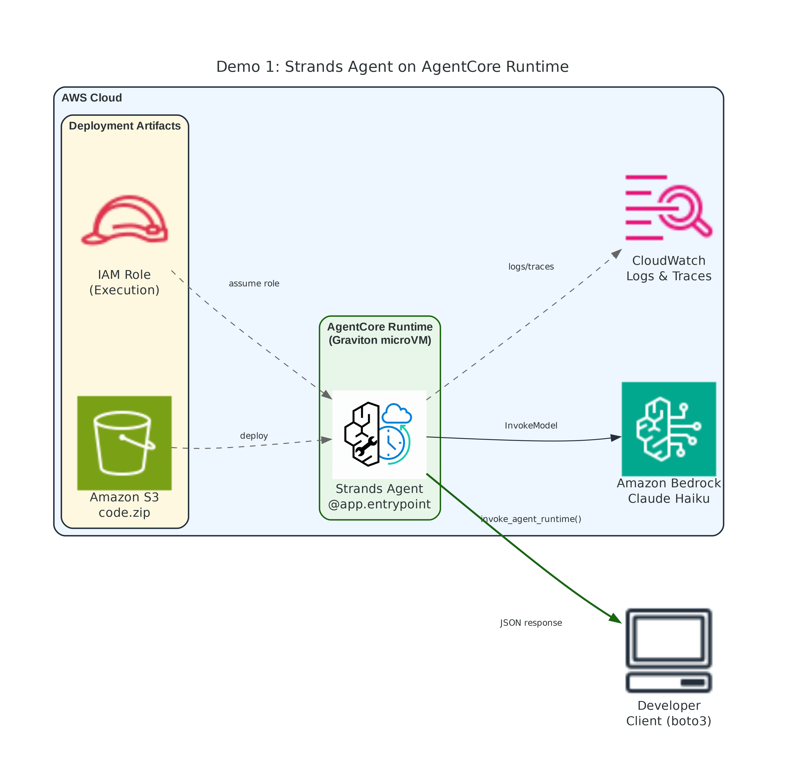
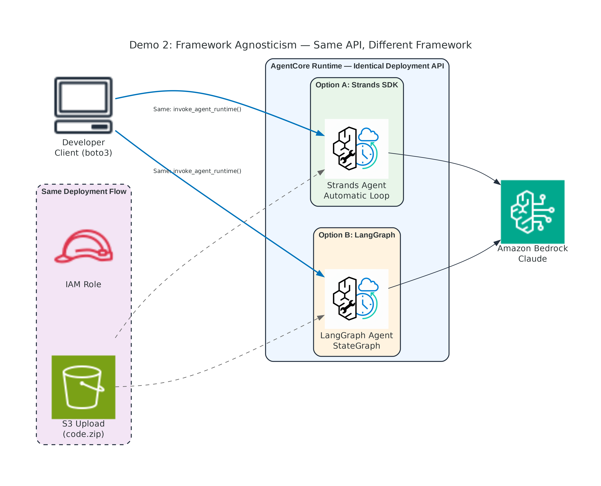
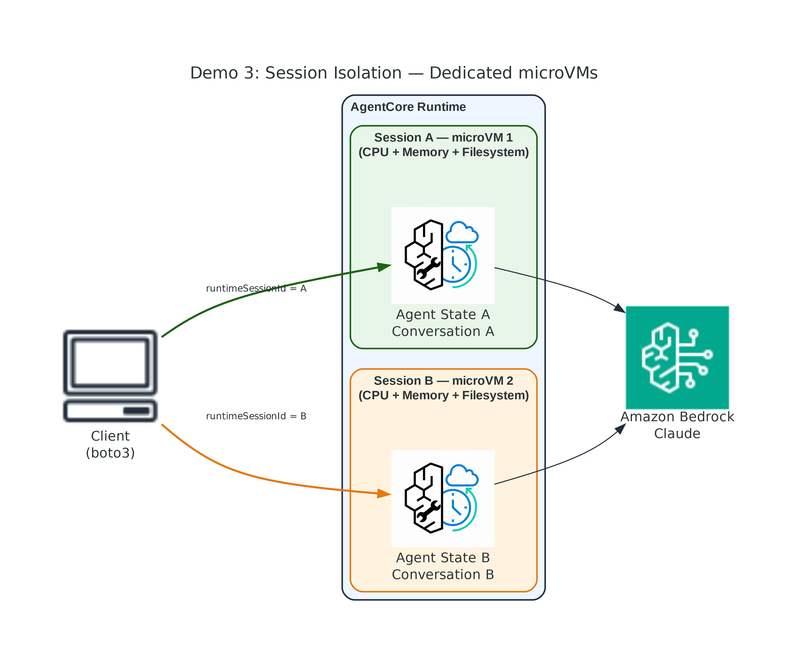
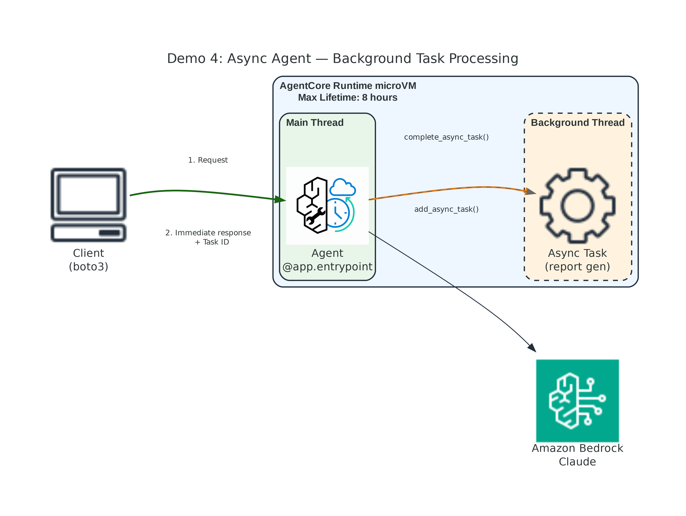
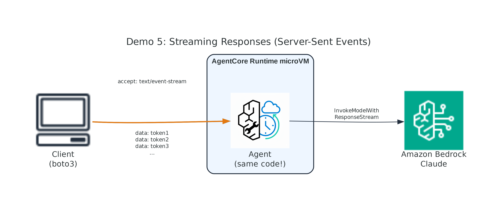

# Module 02: AgentCore Runtime — Instructor Demos

Five hands-on CLI demonstrations for the AgentCore Runtime module.

## Demo Overview

| # | Demo | Key Concepts |
|---|------|--------------|
| 1 | [Strands + Bedrock](demo-01-strands-bedrock/) | SDK basics, deployment lifecycle, endpoints, `@app.entrypoint` |
| 2 | [LangGraph + Bedrock](demo-02-langgraph-bedrock/) | Framework agnosticism — same deploy API, different agent code |
| 3 | [Session Management](demo-03-session-management/) | microVM isolation, session continuity, lifecycle timeouts |
| 4 | [Async Agents](demo-04-async-agents/) | Long-running background tasks, `add_async_task`, 8-hour sessions |
| 5 | [Streaming Responses](demo-05-streaming/) | SSE streaming, `text/event-stream`, reduced latency |

## Architecture Diagrams

Each demo has a high-resolution (300 DPI) architecture diagram in [`diagrams/`](diagrams/):

| Demo | Diagram |
|------|---------|
| Demo 1 |  |
| Demo 2 |  |
| Demo 3 |  |
| Demo 4 |  |
| Demo 5 |  |

To regenerate diagrams: `cd diagrams && python generate_diagrams.py`

---

## Prerequisites

### Software Requirements

| Tool | Version | Purpose |
|------|---------|---------|
| Python | 3.12+ | Agent code and deploy scripts |
| [uv](https://docs.astral.sh/uv/getting-started/installation/) | latest | Build arm64 deployment packages |
| AWS CLI | v2 | Configured with credentials |
| boto3 | ≥1.38.0 | AWS SDK for Python |

### Install dependencies

```bash
python3 -m venv venv
source venv/bin/activate
pip install boto3 bedrock-agentcore strands-agents strands-agents-tools uv
```

### Set your AWS region

```bash
export AWS_DEFAULT_REGION=ap-southeast-1
```

### AWS Account Requirements

- Access to **Amazon Bedrock AgentCore** in your region
- Access to **Amazon Bedrock models** (Claude Haiku 4.5)
- IAM permissions to create roles, S3 buckets, and AgentCore runtimes
- Recommended region: `ap-southeast-1`, `us-east-1`, or `us-west-2`

### (Optional) Deploy CloudFormation Prerequisites

If your account requires pre-provisioned resources:

```bash
cd cloudformation
./deploy-stack.sh            # uses default region
./deploy-stack.sh us-west-2  # or specify region
```

Or manually:

```bash
aws cloudformation deploy \
  --template-file cloudformation/prerequisites.yaml \
  --stack-name mlagac-m02-demo-prereqs \
  --capabilities CAPABILITY_NAMED_IAM
```

> **Note:** The demo scripts create their own IAM roles and S3 buckets dynamically.
> The CloudFormation stack is optional — for locked-down environments only.
> If the stack fails (resource conflicts from prior runs), just skip it — demos work without it.

---

## Step-by-Step Demo Instructions

### Demo 1: Strands + Bedrock (SDK & Deployment Lifecycle)

**What to show the audience:**
- The `BedrockAgentCoreApp` SDK and `@app.entrypoint` pattern
- Direct code deployment (zip → S3 → create_agent_runtime)
- Endpoint creation and invocation
- How tools are defined with `@tool`

```bash
cd demo-01-strands-bedrock

# 1. Show the agent code (highlight @app.entrypoint and @tool)
cat agent.py

# 2. Test locally — starts server on port 8080, sends test prompts
python local_test.py

# 3. Deploy to AgentCore Runtime (~2-3 minutes)
python deploy.py

# 4. Invoke the agent with sample prompts
python invoke.py

# 5. Try a custom prompt
python invoke.py "What is the weather in Miami and what is 100 / 7?"

# 6. Clean up when done
python cleanup.py
```

**Talking points:**
- `BedrockAgentCoreApp` creates `/invocations` + `/ping` automatically
- Local testing validates the HTTP contract before cloud deployment
- `uv` builds arm64 wheels for Graviton microVMs
- `create_agent_runtime()` + `create_agent_runtime_endpoint()` = invocable agent
- No Docker required for direct code deployment

---

### Demo 2: LangGraph + Bedrock (Framework Agnosticism)

**What to show the audience:**
- Same deployment process, completely different framework
- LangGraph's explicit state graph vs Strands' automatic loop
- Proves AgentCore Runtime is framework-agnostic

```bash
cd demo-02-langgraph-bedrock

# 1. Show the agent code (highlight StateGraph, nodes, edges)
cat agent.py

# 2. Test locally — same /invocations contract as Demo 1
python local_test.py

# 3. Deploy — SAME process as Demo 1
python deploy.py

# 4. Invoke — SAME API as Demo 1
python invoke.py

# 5. Custom math prompt
python invoke.py "What is sqrt(144) + log10(1000)?"

# 6. Clean up
python cleanup.py
```

**Talking points:**
- deploy.py is identical in structure — only agent.py changes
- Local test proves the same HTTP contract: POST /invocations + GET /ping
- `invoke_agent_runtime()` doesn't care what framework runs inside
- LangGraph uses explicit nodes/edges; Strands uses automatic loop
- Both produce the same HTTP contract: POST /invocations + GET /ping

---

### Demo 3: Session Management (microVM Isolation)

**What to show the audience:**
- Same session ID → agent remembers (shared microVM)
- Different session ID → agent forgets (isolated microVM)
- Session cleanup with `stop_runtime_session()`
- Configurable timeouts via `lifecycleConfiguration`

```bash
cd demo-03-session-management

# 1. Show the agent code (simple conversational agent)
cat agent.py

# 2. Test locally — verifies agent responds (session isolation is cloud-only)
python local_test.py

# 3. Deploy with 30-minute idle timeout
python deploy.py

# 4. Run the session demo (3 parts: continuity, isolation, cleanup)
python invoke.py

# 5. Clean up
python cleanup.py
```

**Talking points:**
- Local test confirms the agent works; isolation requires microVMs
- Each `runtimeSessionId` maps to a dedicated microVM
- CPU, memory, filesystem all isolated between sessions
- Default idle timeout: 15 minutes (we set 30 min for demo)
- Max session lifetime: up to 8 hours
- `stop_runtime_session()` releases resources immediately

---

### Demo 4: Async Agents (Long-Running Background Tasks)

**What to show the audience:**
- Agent responds immediately with a task ID
- Background thread continues processing
- Session stays active for up to 8 hours
- Pattern for report generation, data analysis, etc.

```bash
cd demo-04-async-agents

# 1. Show the agent code (highlight add_async_task / complete_async_task)
cat agent.py

# 2. Test locally — exercises both sync and async tools
python local_test.py

# 3. Deploy with 8-hour max lifetime
python deploy.py

# 4. Run the demo (sync vs async responses)
python invoke.py

# 5. Clean up
python cleanup.py
```

**Talking points:**
- Local test shows both tools work before deploying
- `app.add_async_task(name)` → registers background work, returns task ID
- `app.complete_async_task(task_id)` → marks done
- Agent stays responsive while background task runs
- Real use cases: report generation, data analysis, ETL pipelines
- Up to 8-hour session lifetime for complex workflows

---

### Demo 5: Streaming Responses (SSE)

**What to show the audience:**
- Same agent code, different client behavior
- Streaming is controlled by `accept` header only
- Tokens appear in real time (improved UX)
- No agent code changes needed

```bash
cd demo-05-streaming

# 1. Show the agent code (IDENTICAL to non-streaming agent)
cat agent.py

# 2. Test locally — confirms agent responds (SSE requires cloud deployment)
python local_test.py

# 3. Deploy
python deploy.py

# 4. Run the comparison (non-streaming vs streaming)
python invoke.py

# 5. Try with a detailed prompt
python invoke.py "Explain the theory of relativity in detail"

# 6. Clean up
python cleanup.py
```

**Talking points:**
- Local test proves agent code is unchanged for streaming
- Streaming = `accept: text/event-stream` (client-side only)
- Non-streaming = `accept: application/json` (default)
- SSE format: `data: token1\ndata: token2\n...`
- First token arrives much faster than full response
- Max streaming duration: 60 minutes

---

## Recommended Demo Order

For a live classroom presentation:

1. **Demo 1** (5 min) — Establish the SDK, deployment model, and basic flow
2. **Demo 2** (3 min) — Quick comparison showing framework agnosticism
3. **Demo 3** (5 min) — Interactive session demo showing isolation
4. **Demo 5** (3 min) — Visual streaming demo (impressive for audience)
5. **Demo 4** (4 min) — Async pattern for long-running workloads

**Total demo time:** ~20 minutes (plus 2-3 min deploy time per demo)

**Pro tip:** Deploy Demos 1-5 in advance before the class starts. Keep the `runtime_config.json` files. Then during the live demo, just run `invoke.py` for each.

---

## Bulk Deploy / Cleanup

Deploy all 5 demos at once (takes ~10-15 minutes):

```bash
for d in demo-01-strands-bedrock demo-02-langgraph-bedrock demo-03-session-management demo-04-async-agents demo-05-streaming; do
  echo "=== Deploying $d ==="
  (cd "$d" && python deploy.py)
done
```

Clean up all demos:

```bash
for d in demo-01-strands-bedrock demo-02-langgraph-bedrock demo-03-session-management demo-04-async-agents demo-05-streaming; do
  echo "=== Cleaning $d ==="
  (cd "$d" && python cleanup.py)
done
```

---

## Cleanup CloudFormation (if deployed)

```bash
cd cloudformation
./cleanup-stack.sh            # uses default region
./cleanup-stack.sh us-west-2  # or specify region
```

---

## File Structure

```
demo/runtime/
├── README.md                          ← This file
├── shared/
│   ├── __init__.py
│   ├── colors.py                     ← ANSI color utilities
│   ├── deploy_helpers.py             ← Shared deployment utilities
│   └── local_test.py                 ← Shared local testing utility
├── cloudformation/
│   ├── prerequisites.yaml            ← Optional: pre-provision S3 + IAM
│   ├── deploy-stack.sh               ← Deploy the CFN stack
│   └── cleanup-stack.sh              ← Delete the CFN stack
├── diagrams/
│   ├── generate_diagrams.py          ← Generate architecture PNGs (300 DPI)
│   ├── demo-01-architecture.png
│   ├── demo-02-architecture.png
│   ├── demo-03-architecture.png
│   ├── demo-04-architecture.png
│   └── demo-05-architecture.png
├── demo-01-strands-bedrock/
│   ├── agent.py                      ← Strands + Bedrock agent
│   ├── requirements.txt
│   ├── local_test.py                 ← Test locally on port 8080
│   ├── deploy.py
│   ├── invoke.py
│   └── cleanup.py
├── demo-02-langgraph-bedrock/
│   ├── agent.py                      ← LangGraph + Bedrock agent
│   ├── requirements.txt
│   ├── local_test.py
│   ├── deploy.py
│   ├── invoke.py
│   └── cleanup.py
├── demo-03-session-management/
│   ├── agent.py                      ← Session-aware agent
│   ├── requirements.txt
│   ├── local_test.py
│   ├── deploy.py
│   ├── invoke.py
│   └── cleanup.py
├── demo-04-async-agents/
│   ├── agent.py                      ← Async agent with background tasks
│   ├── requirements.txt
│   ├── local_test.py
│   ├── deploy.py
│   ├── invoke.py
│   └── cleanup.py
└── demo-05-streaming/
    ├── agent.py                      ← Streaming agent
    ├── requirements.txt
    ├── local_test.py
    ├── deploy.py
    ├── invoke.py
    └── cleanup.py
```

## Troubleshooting

| Issue | Solution |
|-------|----------|
| `uv: command not found` | Install uv: `pip install uv` or `curl -LsSf https://astral.sh/uv/install.sh \| sh` |
| Runtime stuck in CREATING | Wait 3-5 minutes; check CloudWatch logs for init errors |
| `CREATE_FAILED` | Usually missing permissions — ensure IAM role has all required policies |
| `initialization time exceeded` | arm64 wheels not in zip — verify `uv` is building with `--python-platform aarch64-manylinux2014` |
| Model access denied | Enable Claude Haiku in Bedrock console for your region |
| S3 bucket already exists | Expected — scripts handle this gracefully |
